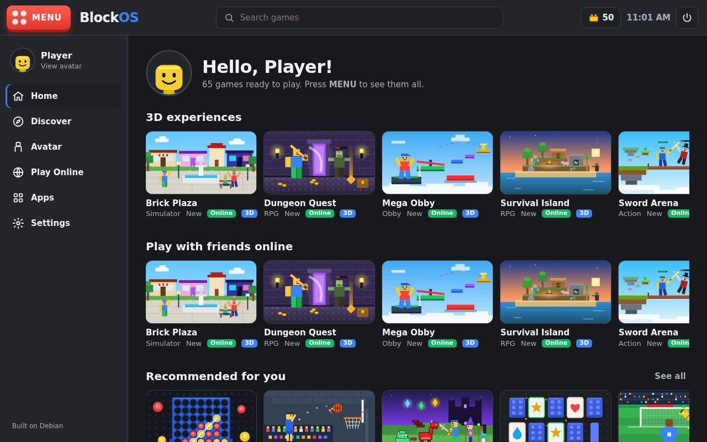
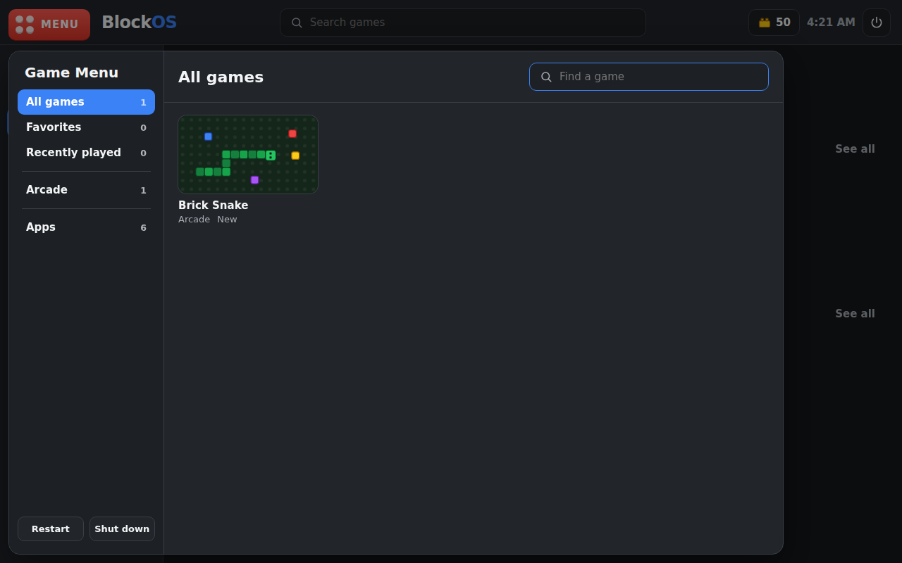
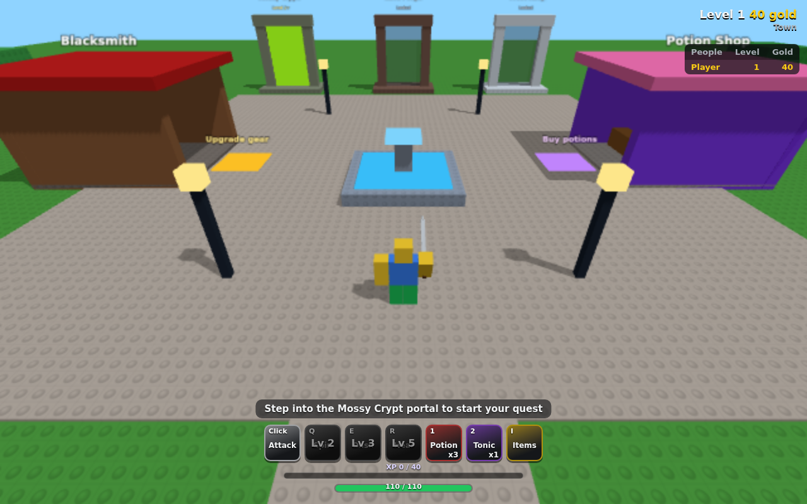
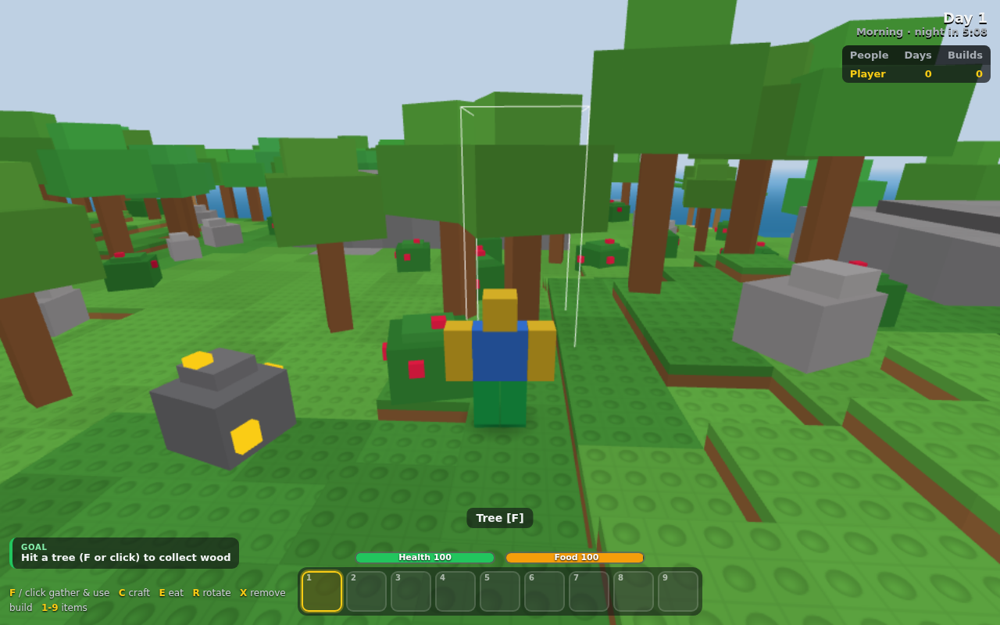

# BlockOS

BlockOS is a game-focused desktop built on **Debian Linux**. It's styled after Roblox, with dark panels,
rows of game cards, a blocky avatar you can dress up, and a currency (Bricks) you earn by playing.
It runs as a virtual machine on a Mac.

The big red **MENU** button in the top-left corner opens the Game Menu, which has every game sorted
into categories, plus favorites, recently played, apps, and the power buttons.

> BlockOS is a fan-made project. It is not made by, affiliated with, or endorsed by Roblox Corporation.
> It uses no Roblox code, logos, or art.






## What's inside

| Part | Where | What it does |
| --- | --- | --- |
| Desktop shell | `shell/` | The BlockOS desktop: Home, Discover, Community, Create, Avatar (with a shop), Apps, Settings, the Game Menu and the in-game menu. Plain HTML/CSS/JS, works offline. |
| Create studio | `shell/studio/` | Write your own games in a code editor with templates and a help guide, test them, and publish them. Player-made games run in a locked sandbox (`studio/runner.js`). |
| Games | `shell/games/` | 70 original games (list below). Each one is a folder with `index.html` and `thumb.svg`. |
| 3D kit | `shell/games/kit3d.js` | Roblox-style 3D worlds (bundled three.js): studded parts, your avatar as a 3D character, camera, physics, other online players. |
| Game server | `multiplayer/relay.js` | Lets players play together online (Node.js). Hosted from the Play Online page, or on the internet. |
| Shell server | `shell/server.py` | Serves the desktop on `127.0.0.1:8737` and lets it open real Linux apps (Terminal, Files, Web Browser, Text Editor, Task Manager, Calculator) and shut down or restart. Only allowlisted commands can run. |
| Session | `system/blockos-session` | Starts Openbox, the shell server, and Chromium in full-screen kiosk mode showing the desktop. |
| Installer | `system/install.sh` | Turns a plain Debian 12 or 13 install into BlockOS: installs packages, sets up auto-login, adds boot-menu branding. |
| Mac & Windows app | `mac-app/` | Builds the BlockOS app (Electron) for macOS and Windows: the desktop in its own window, no VM needed. |
| ISO builder | `iso/build-iso.sh` | Builds a bootable BlockOS live ISO with Debian `live-build` inside Docker. |

## Quickest: the BlockOS Mac app

`BlockOS.app` is a real Mac app with its own window and Dock icon. It runs the BlockOS desktop and games
without a VM. It isn't a real operating system:

- On the Apps page, Terminal, Files, Web Browser and the others open the matching Mac apps
  (Terminal, Finder, Safari, TextEdit, Activity Monitor, Calculator).
- "Shut down" closes BlockOS, and "Restart" restarts BlockOS, not your Mac.

**Install it:** unzip `BlockOS-mac-arm64.zip` (Apple Silicon Macs) or `BlockOS-mac-x64.zip` (Intel Macs)
and drag `BlockOS.app` into Applications. The app isn't signed by a registered Apple developer, so
the first time you open it macOS blocks it. Go to **System Settings → Privacy & Security** and click
**Open Anyway**. If macOS still refuses, run `xattr -dr com.apple.quarantine /Applications/BlockOS.app`.

**Build it yourself** (needs Node.js; works on macOS or Linux):

```sh
cd blockos/mac-app
./build.sh            # makes build/BlockOS-mac-arm64.zip and build/BlockOS-mac-x64.zip
npm start             # or just run it from the repo without packaging
```

The app is built with [Electron](https://www.electronjs.org/) (`mac-app/main.js`). It serves the desktop
from `shell/` and answers the same small `/api/*` that `server.py` provides on the VM.

`mac/make-app.sh` builds an older, lighter launcher instead. It opens BlockOS in a browser window
and needs Python 3.

## BlockOS for Windows

The same app runs on Windows 10 and 11. On the Apps page, Terminal, Files, Web Browser and the others
open PowerShell, File Explorer, Edge, Notepad, Task Manager and Calculator.

1. Download **BlockOS-windows-x64.zip** from the
   [download page](https://github.com/speedyteam101/chainsaw-man-mod/releases/tag/blockos)
   (or **BlockOS-windows-arm64.zip** for a Windows-on-ARM PC).
2. Right-click the zip → **Extract All**. Don't run it from inside the zip.
3. Open the **BlockOS** folder and double-click **BlockOS.exe**. Right-click it → **Show more options →
   Send to → Desktop (create shortcut)** to get a desktop shortcut.
4. The app isn't signed, so the first time Windows SmartScreen may say "Windows protected your PC".
   Click **More info → Run anyway**. When you host a server, Windows Firewall may ask about network
   access; allow it on private networks.

Build it yourself with `cd blockos/mac-app && ./build.sh --win` (works on Windows, Mac or Linux).

## Run the real OS on a Mac (VM)

This installs normal Debian in a VM, then runs the BlockOS installer on it. Your progress (Bricks,
avatar items, best scores) is kept between restarts.

1. **Install UTM**, a free virtual machine app for macOS: <https://mac.getutm.app/>
2. **Download Debian's small "netinst" installer ISO** from <https://www.debian.org/distrib/netinst>.
   Pick **arm64** on an Apple Silicon Mac (M1/M2/M3/M4...) or **amd64** on an Intel Mac.
3. In UTM: **Create a New Virtual Machine → Virtualize → Linux**, choose the ISO, then give it
   about **4 GB of memory, 2 or more CPU cores, and a 20 GB disk**.
4. Start the VM and go through the Debian installer. On the **Software selection** screen,
   **untick "Debian desktop environment" and "GNOME"** (BlockOS brings its own desktop) and keep
   "standard system utilities". Remember the user name and passwords you choose.
5. When the installer finishes, shut the VM down, remove the ISO from the VM's CD/DVD drive in UTM, and start it again.
6. Log in on the text console and get BlockOS onto the VM, for example:
   ```sh
   su -                      # become root (enter the root password from the installer)
   apt install -y git
   git clone -b claude/gracious-shannon-5b5f3r https://github.com/speedyteam101/chainsaw-man-mod.git
   ./chainsaw-man-mod/blockos/system/install.sh --user YOUR_USER_NAME
   reboot
   ```
   If you left the root password empty in the installer, your user can use `sudo` instead:
   `sudo ./chainsaw-man-mod/blockos/system/install.sh`.
   If the repository is private, `git clone` will ask you to sign in. You can also download it as a
   ZIP on another computer and copy it over.
7. After the reboot, BlockOS starts by itself and logs you in automatically.

## Or build a live ISO

```sh
cd blockos/iso
./build-iso.sh            # needs Docker Desktop; builds for your Mac's chip
```

The ISO goes into `blockos/iso/out/`. Boot it in UTM the same way as step 3 above, without
installing Debian first. A live ISO starts fresh on every boot, so progress isn't saved.

**Heads-up:** the ISO build hasn't been tested end to end yet, because the environment it was written in
couldn't reach Debian's package servers. The installer from the recommended route was checked in a Debian 13
container, but its package downloads were not. If the ISO build fails, use the recommended route
and please report the error.

## Using BlockOS

- **MENU** (or tap the Super/Command key on its own) opens the Game Menu. Search, pick a category,
  click a game, then press the big green Play button.
- In a game, **Esc** or the button in the top-left corner opens the in-game menu: Resume, Reset game, or Leave game.
- Every finished round earns **Bricks**, and a new personal best earns extra. Spend them on hats,
  faces and shirts in **Avatar**.
- **Apps** opens Terminal, Files, Web Browser, Text Editor, Task Manager and Calculator.
  Switch between windows with Alt+Tab.
- **Settings** has your display name, dark/light mode, accent color, game sounds, progress reset,
  system info, and Restart / Shut down. The power button in the top bar does the same.

## Make your own games (Create and Community)

Open **Create** to make games with code, like Roblox Studio:

- **New game** starts from a template (Clicker, Platformer, Dodge, 3D obby, Online hangout and
  more) with comments that explain what to change. **Help** has a guide to the BlockOS game kit.
- **Run** (Ctrl+Enter) shows your game next to the code; mistakes appear under **Output** with
  the line number (click it to jump there). Your games save on this computer as you type.
- **Save file** keeps a copy as an `.html` file, and **Open a file** loads one, so you can
  share a game by sending the file.
- **Publish** puts your game on the server you're online on. The server's owner checks it first;
  after that, everyone on that server finds it on the **Community** page, where they can play it,
  like it, **Remix** it (copy it into Create to see how it works) or **Report** it.

Community games run in a sandbox: they can't see your Bricks, friends or other games, can't open
websites, and don't earn Bricks. If you host the server, you're its moderator: new games to
check appear under **Community → Review**. Moderating a server you run elsewhere is explained in
[`multiplayer/README.md`](multiplayer/README.md#community-games-made-by-players).

## Play online with friends

Open **Play Online** in BlockOS.

- **Same Wi-Fi:** one person clicks **Start hosting**. Everyone else types the address it shows
  (like `192.168.1.23`) under **Join a server**. Games marked **Online** then put you all in the
  same world, where you see each other's avatars.
- **Friends anywhere in the world (Mac and Windows app):** the host clicks **Start hosting**, then
  **Let friends anywhere join**. BlockOS downloads Cloudflare's free connector (`cloudflared`, about
  20 MB, the first time only) and shows an address like `wss://happy-blocks-123.trycloudflare.com`.
  Friends type it under **Join a server**. Keep BlockOS open while people play. The address
  changes each time, and Cloudflare's free tunnels have no uptime guarantee.
- **Always-on servers for everyone, like Roblox:** put the game server on a cloud host and set its
  address as `officialServer` in `shell/config.js`. Every copy of BlockOS then goes online there by
  itself. See [`multiplayer/README.md`](multiplayer/README.md).

**Servers:** like Roblox, each online game has numbered servers with up to 12 players each. A
game's page lists them, with player counts and which friends are on each, and **Join** buttons.
**Play** puts you on the busiest server that still has room, and **New server** starts an empty one.
Game tiles show how many people are playing right now.

**Chat:** in an online game press `/` (or tap **Chat**), type, and press Enter. Messages show in the
chat log and as bubbles over heads in 3D games.

**Friends:** everyone has a friend code (shown on the **Friends** page). Add friends by code, or
with **Add friend** in a game's **People** list; they have to accept. The Friends page shows who's
online and what they're playing (with a **Join** button), and lets you send private messages.

**Safety:**
- The game server filters every message: swear words and personal details (phone numbers, email
  addresses, links, street addresses, social-media names) show as `####`.
- Only friends can send you private messages.
- **Mute** anyone from a game's People list.
- **Settings → Chat** chooses who can chat with you: Everyone, Friends only, or Nobody.
- Only play with people you know.

Games also award **badges** (shown in Avatar → Badges, +10 Bricks each). Where it makes sense, you
play as your own avatar.

## Games

70 original games, sorted by genre in the Game Menu. Every game awards badges.

| Genre | Games |
| --- | --- |
| **Action** | Battle Tanks, Blob Rush, Disaster Island, Getaway, Sword Arena (3D, online), Sword Duel, The Floor Is Lava |
| **Adventure** | Maze Escape |
| **Arcade** | Bonk-a-Block, Brick Breaker, Brick Pinball, Brick Snake, Cave Copter, Flap Block, Ninja Run, Rhythm Tap, Road Hopper, Sky Jumper, Space Blaster, Tower Stack |
| **Board** | Checkers, Dots and Boxes, Four in a Row, Reversi, Tic Tac Block |
| **Card** | Solitaire |
| **Obby** | Mega Obby (3D, online), Obby Run, Tower Climb, Tower Rush (3D, online) |
| **Puzzle** | Block Drop, Brick 2048, Bubble Pop, Color Echo, Color Sort, Gem Bricks, Lights Out, Math Blitz, Memory Bricks, Mine Sweep, Pipe Connect, Pixel Logic, Slide Puzzle, Sudoku Blocks |
| **RPG** | Brick Legends, Dungeon Quest (3D, online), Survival Island (3D, online) |
| **Racing** | Kart Dash, Turbo Lanes, Typing Racer |
| **Science** | Cell City, Circuit Builder, Element Crafter, Rocket Lab (3D, online), Velocity Lab |
| **Simulator** | Brick Plaza (3D, online), Brick Tycoon, Fishing Frenzy, Mining Sim, Pet Hatchery, Pizza Shop |
| **Sports** | Air Hockey, Basket Toss, Block Bowling, Block Golf, Paddle Clash, Penalty Kick |
| **Strategy** | Brick Defense |
| **Word** | Word Bricks, Word Search |

## Add your own game

1. Make a folder `shell/games/my-game/` with an `index.html`. Copy `shell/games/brick-snake/index.html`
   as a starting point. It uses the shared helpers in `shell/games/kit.js` (canvas setup, keyboard,
   game loop, start/game-over screens, sounds, best scores), which are documented at the top of that file.
2. Add a `thumb.svg` (480 x 270) for the game card.
3. Add a `meta.json` (copy brick-snake's; add `"is3d": true` / `"multiplayer": true` if they apply) and run `python3 blockos/tools/gen-catalog.py` to rebuild `shell/games/catalog.js`.
   For a 3D game, start from `shell/games/_example3d/` and the API notes at the top of `shell/games/kit3d.js`.
4. Call `Kit.finish("my-game", score)` when a round ends so the player earns Bricks.

On an installed system, copy the changed `shell/` folder to `/opt/blockos/shell`, or simply run
`install.sh` again.

## Preview the desktop without a VM

```sh
python3 blockos/shell/server.py --dry-run
```

Then open <http://127.0.0.1:8737/> in a browser. `--dry-run` prints app and power commands instead of running them.

## Troubleshooting

- **Black or flickering screen after login:** add `--disable-gpu` to `/etc/blockos/browser-flags`
  (one line) and reboot. If that doesn't help, try a different display device in the VM's UTM settings.
- **The screen doesn't resize with the UTM window:** the `spice-vdagent` package handles this, and it
  depends on UTM's display settings. You can also pick a resolution in the VM's settings.
- **Getting to a normal login screen:** run `install.sh --no-autologin`. Then pick the "BlockOS"
  session (or another one) on the login screen.
- **Logs:** `~/.xsession-errors` in the BlockOS user's home folder.
